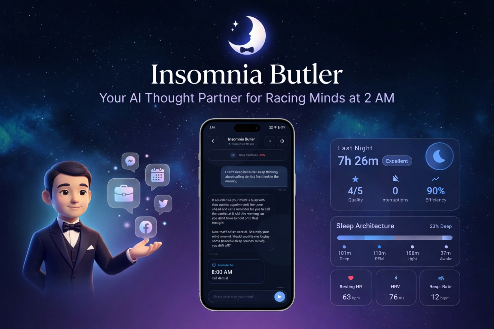
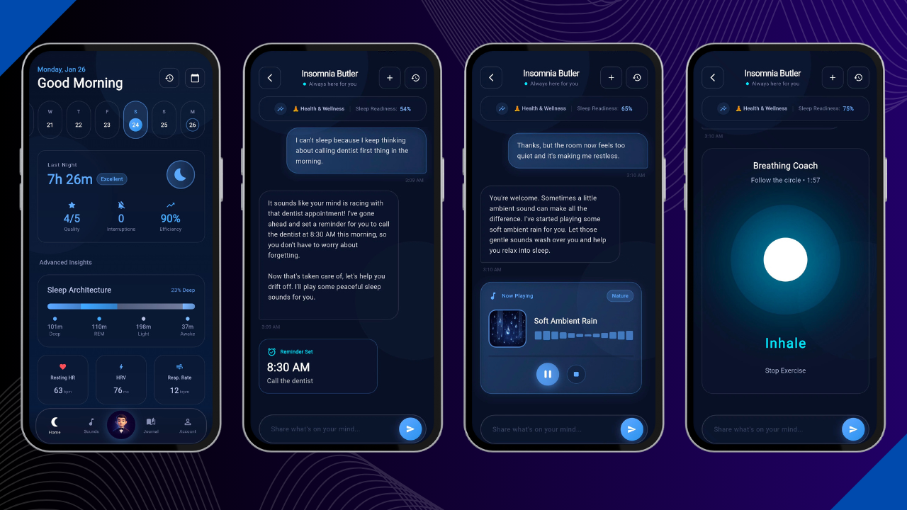
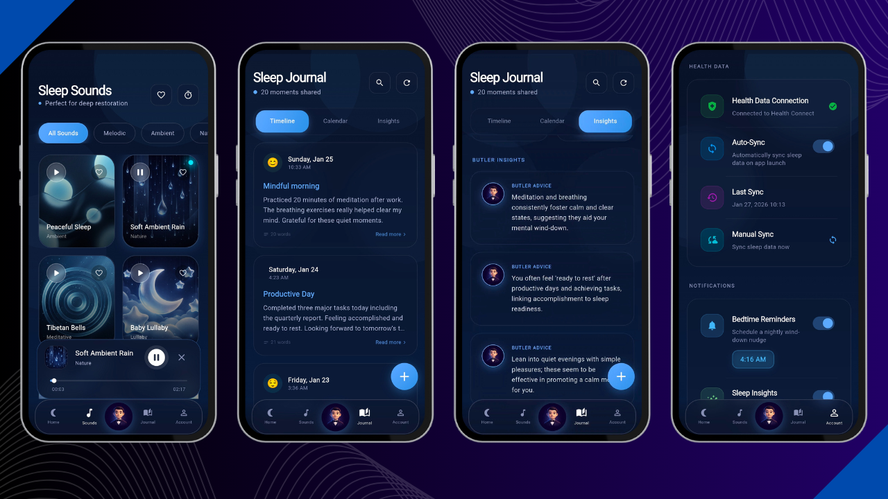
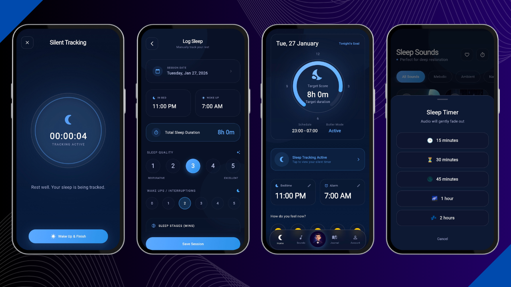
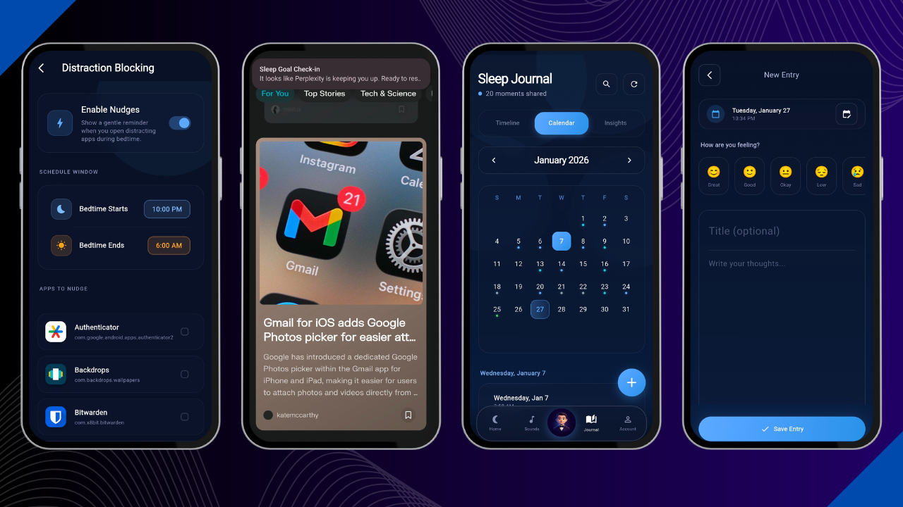

# 💤 Insomnia Butler

**Your Intelligent AI Thought Partner for Racing Minds at 2 AM**

[](https://flutter.dev)
[](https://serverpod.dev)
[](https://deepmind.google/technologies/gemini/)
[](https://www.postgresql.org/)

---

## 📱 Screenshots

<div align="center">

|  |  |
|:---:|:---:|
| *Screenshot 1* | *Screenshot 2* |

|  |  |
|:---:|:---:|
| *Screenshot 3* | *Screenshot 4* |

</div>

---

## 🎥 Demo

<div align="center">

[](https://youtu.be/Nv9RRJnVVbQ)

*Click to watch the full demo on YouTube*

</div>

---

## 🌟 Executive Summary

**Insomnia Butler** is a premium, AI-powered companion designed to resolve the root cause of late-night wakefulness: a racing mind. Unlike traditional sleep apps that only offer passive sounds, the Butler engages in a structured, therapeutic dialogue to **organize your thoughts, provide cognitive reframing, and guide you into a restful state.**

By combining **Cognitive Behavioral Therapy (CBT-I) principles**, **Gemini Intelligence**, and **Long-term Vector Memory**, we create a personalized sanctuary that learns your patterns and helps you "park" your worries so you can finally rest.

---

## 🚀 Key Features

### 🧠 AI Thought Clearing Engine (Core Feature)
A sophisticated chat interface powered by **Gemini** that acts as your personal cognitive coach.
- **Socratic Questioning:** Guides you to resolve worries rather than just venting.
- **Automatic Categorization:** Identifies if thoughts are related to Work, Social, Finances, or Health.
- **AI Actions:** The Butler can actively assist you by:
  - 🎵 **Playing Sleep Sounds** directly in the chat.
  - 📅 **Scheduling Reminders** for tomorrow so you can let go today.
  - 🚫 **Sending Gentle Nudges** when you open distracting apps during bedtime.
  - 🧘 **Launching Breathing Exercises** when it detects high anxiety.
- **Context-Aware Memory:** Uses **Vector Embeddings (pgvector)** to remember your past worries and journals, providing continuity across sessions.

### 📊 Advanced Sleep Architecture Tracking
Go beyond simple "hours slept" with high-fidelity metrics:
- **Sleep Stages:** Visual breakdown of Deep, Light, REM, and Awake periods.
- **Physiological Recovery:** Track Resting Heart Rate (RHR), HRV, and Respiratory Rate.
- **Efficiency Scoring:** Dynamic calculation of your sleep quality and sleep consistency.
- **Interruptions Tracking:** Log and analyze wake-up events during the night.

### 🏥 Health Data Integration
Seamlessly sync your sleep data from your wearable devices:
- **Apple Health (iOS):** Import sleep sessions from Apple Watch.
- **Health Connect (Android):** Sync data from Oura, Fitbit, Samsung Health, and more.
- **Smart Synchronization:** 
  - **Auto-Sync:** Background import on app launch.
  - **Manual Import:** Select specific date ranges to backfill your history.
  - **Data Source Badges:** Clearly see which device recorded your sleep (e.g., "Apple Watch", "Oura Ring").

### 🎵 Immersive Sleep Sounds & Ambience
A curated library of high-quality audio landscapes.
- **3D Glassmorphic Album Art:** Stunning visuals for every soundscape.
- **Pro Playback Controls:** Seamless seeking, background playback, and fade-out timers.
- **AI Suggested Audio:** The Butler suggests specific sounds based on your current mood.

### 🧘 Interactive Breathing Coach
An integrated breathing widget featuring:
- **Guided Visuals:** Expanding/contracting circles to pace your breath.
- **Box Breathing Technique:** Proven 4-4-4 rhythm to reduce anxiety.
- **Visual Pacing:** Follow the gentle animations to regulate your nervous system.

### 📅 Historical Intelligence & Analytics

- **Monthly Calendar View:** Swipeable strip or full monthly view to see sleep consistency.
- **Trend Insights:** Dashboard cards showing Sleep Latency improvement, Consistency Score %, and Streaks.
- **Mood Tracker:** Log your daily mood to see how you feel after different sleep qualities.

### 🚫 Smart Distraction Nudges
Intelligent notification system that detects when you open distracting apps (social media, games) during your scheduled bedtime window and sends gentle high-priority reminders to help you stay on track with your sleep goals.

### 📅 Daily Butler's Insights
The Butler doesn't just track data; it provides scheduled, proactive wisdom.
- **Automated AI Analysis**: Every day at your preferred time, the Butler analyzes your latest sleep metrics and journal entries using Gemini AI.
- **Scheduled Background Jobs**: Leverages **Serverpod FutureCalls** to handle generation in the background without user intervention.
- **Performance Caching**: All insights are cached in a dedicated database schema, providing instant access to the latest "Butler's Tips."
- **User-Defined Preferences**: Toggle insights for Sleep or Journals and set specific notification times through the Account dashboard.

### 💬 Session History & Context
- **Chat Archives:** Review past conversations and advice from the Butler.
- **Continuous Memory:** The AI remembers context from previous days to provide personalized support.

---

## 💎 The "Deep Night" Experience

The application features a high-fidelity **Glassmorphic UI** designed for low-light environments.
- **Subtle Glows & Gradients:** A curated palette of Deep Navy, Sky Blue, and Lavender.
- **Micro-animations:** Smooth transitions and haptic feedback to reduce digital friction.
- **Time-Aware Interface:** Dynamic greetings and affirmations that change based on the time of day.

---

## 💻 Tech Stack

| Layer | Technology |
| :--- | :--- |
| **Mobile App** | Flutter (Dart) with `flutter_animate`, `glass_kit` & `health` (HealthKit/Health Connect) |
| **Backend** | Serverpod 3.0 (Dart) |
| **AI Intelligence** | Google Gemini |
| **Vector Search** | pgvector (PostgreSQL) for RAG |
| **Database** | PostgreSQL 18.1 |
| **Infrastructure** | Serverpod Cloud |

---

## ⚙️ Getting Started

### Prerequisites
- [Flutter SDK](https://docs.flutter.dev/get-started/install)
- [Serverpod CLI](https://docs.serverpod.dev/getting-started/installing-serverpod)
- [Docker & Docker Compose](https://www.docker.com/get-started)
- [Gemini API Key](https://aistudio.google.com/app/api-keys)

### Setup

1.  **Clone the repository:**
    ```bash
    git clone https://github.com/Naazimsnh02/insomniabutler.git
    cd insomniabutler
    ```

2.  **Configure Environment:**
    - Navigate to `insomniabutler_server/config/`
    - Copy `passwords.template.yaml` to `passwords.yaml` if it doesn't exist.
    - Update `passwords.yaml` with your `geminiApiKey` and database credentials.

3.  **Spin up Postgres with pgvector:**
    ```bash
    cd insomniabutler_server
    docker-compose up -d
    ```

4.  **Migrate & Run Server:**
    ```bash
    dart bin/main.dart --apply-migrations
    ```

5.  **Run Flutter App:**
    ```bash
    cd insomniabutler_flutter
    flutter run
    ```

---

## 🚀 Deployment

The project is deployed via **Serverpod Cloud**, which handles infrastructure orchestration, database management, and scaling.

### Serverpod Cloud Deployment

1. **Prerequisites:**
   - Install the `scloud` CLI tool (bundled with Serverpod).
   - Ensure you are logged in: `scloud login`.

2. **Configure Secrets:**
   Set your sensitive API keys (like Gemini) using the cloud secret manager:
   ```bash
   scloud secret set GEMINI_API_KEY YOUR_ACTUAL_KEY
   ```

3. **Deploy the Project:**
   Run the deployment command from the root of the Git repository:
   ```powershell
   scloud deploy --project-dir ./insomniabutler_server
   ```
   *This will automatically:*
   - Generate necessary Serverpod code.
   - Build the Flutter web application.
   - Package the server and upload it to Serverpod Cloud.
   - Run database migrations if necessary.

4. **Verify Deployment:**
   Check the status of your live environment:
   ```bash
   scloud deployment show
   ```

5. **Connect the Client:**
   After a successful deployment, you will receive your project's unique URLs.
   - **How to find your URLs**: Run `scloud project list` or check your project settings at [console.serverpod.cloud](https://console.serverpod.cloud).
   - **Update configuration**:
     1. Open `insomniabutler_flutter/assets/config.json` and update the `apiUrl` with your new Cloud API URL.
     2. Open `insomniabutler_flutter/lib/main.dart` and update the `serverUrl` fallback variable (around line 58) to ensure the app connects to the correct endpoint.

6. **Web Application Access**:
   Your Flutter web app is automatically hosted and accessible via the provided web URL (e.g., `https://your-project-id.serverpod.space/`).

---

## 📜 License

This project is licensed under the MIT License - see the [LICENSE](LICENSE) file for details.

---
